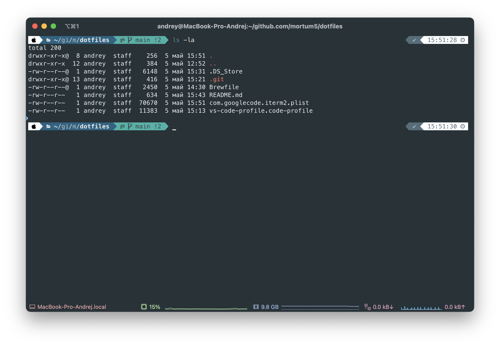

# About

Just yet another dotfiles repo

## Todo

- [ ] Vim
- [ ] Zsh

## Iterm2

Preference config `com.googlecode.iterm2.plist`

## Brew

Installed apps `Brewfile`

## Go package

- ali
- dlv
- expvarmon
- golangci-lint
- hey
- httpstat
- lensm
- migrate
- protoc
- sqlc
- swag

## External install apps via App store or something else

- Amorphous Disk Mark
- Araxis Merge
- Arc
- Bartender
- Beekeeper Studio
- Bruno
- Cakebrew
- Chrome
- CleanMyMac X
- Edison Email
- Filefly
- HiddenBar
- IHosts
- IINA
- Lens
- Macs Fan Control
- Magnet
- Medis
- Monocle
- Obsidian
- OpenVPN
- Orbstack
- Powerlevel10k
- QBittorrent
- Server Cat
- VS Code
- Wireshark
- Zsh